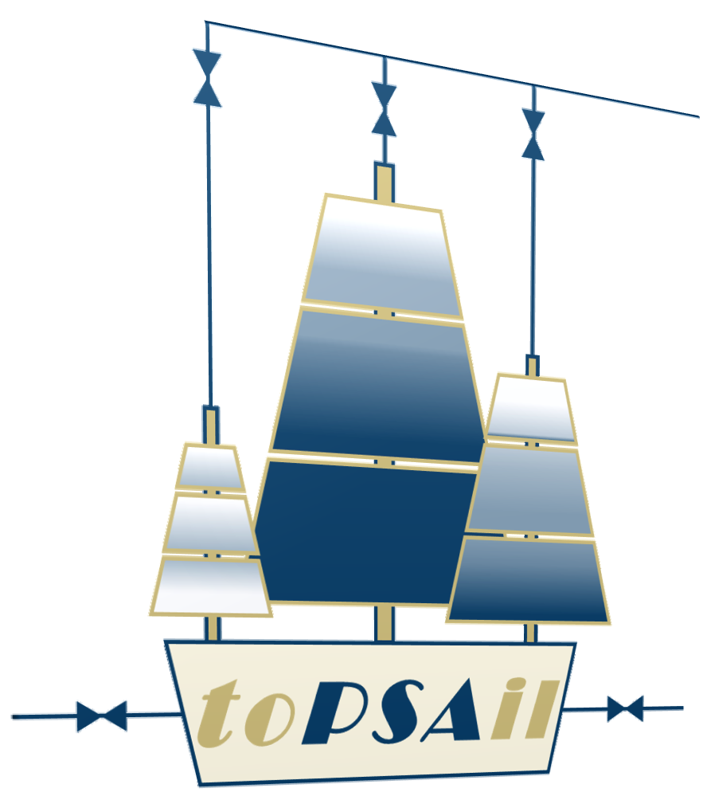

# $\textsf{toPSAil}$ [tάpseil]

> $\textsf{Totally Open Pressure Swing Adsorption Intensification Laboratory (toPSAil)}$ is an open-source pressure swing adsorption (PSA) process simulator, written in $\textsf{MATLAB}^{\textregistered}$.

<!-- Import the logo -->
[](https://github.com/taehunk333/toPSAil)

# Getting Started


Please use the code in the `main` branch of this repository. The `develop` branch is continuously being developed, and full functionality of the code is not guaranteed.

## YouTube Tutorials

Please visit [the Official YouTube Channel for toPSAil](https://www.youtube.com/@toPSAil-dev) for the latest tutorials on how to use $\textsf{toPSAil}$.

# References

> Please refer to the following references for accessing more details on the deveolpment of $\textsf{toPSAil}$.

## Published Manuscripts
* [T.-H. Kim and J. K. Scott (2023). Dynamic Modeling and Simulation of Pressures Swing Adsorption Processes Using toPSAil, *Computers and Chemical Engineering*, Vol. 176 p. 108309.](https://www.sciencedirect.com/science/article/pii/S0098135423001795)
* [T.-H. Kim, Computational Methods for Intensifying the Design and Operation of Pressure Swing Adsorption Processes, *Doctoral Dissertation*, The Geoergia Institute of Technology, Feb. 2023.](https://hdl.handle.net/1853/71950)

## Oral Presentations
* T.-H. Kim and J. K. Scott. $\textsf{Totally Open Pressure Swing Adsorption Intensification Laboratory (toPSAil)}$, *American Institute of Chemical Engineers (AIChE) 2021 Annual Meeting*, Boston, MA.

# Licensing Information

> $\textsf{Totally Open Pressure Swing Adsorption Intensification Laboratory (toPSAil)}$ is released under the `GPL-3.0 license`.

* The $\textsf{Totally Open Pressure Swing Adsorption Intensification Laboratory (toPSAil)}$, herein referred to as *the simulator*, was developed at the [Georgia Institute of Technology](https://www.gatech.edu) by Taehun Kim and Dr. Joseph K. Scott and is owned by [Georgia Tech Research Corporation](https://gtrc.gatech.edu).
* The work was supported by [Rapid Advancement in Process Intensification Deployment (RAPID) institute](https://www.aiche.org/rapid)’s Center for Process Modeling (CPM) led by Drs. [Chau-Chyun Chen](https://www.depts.ttu.edu/che/faculty/chau-chyun_chen/index.php), [Maximilian B. Gorensek](https://www.aiche.org/community/bio/maximilian-b-gorensek-pe), and [Joseph K. Scott](https://chbe.gatech.edu/people/joseph-scott).
* The simulator is available to academic research and noncommercial purposes within the RAPID Community for free.
* Any commercial usage of the simulator will require the member to negotiate a non-exclusive license from [Georgia Tech (GT) Office of Technology Licensing (OTL)](https://licensing.research.gatech.edu).
* For information on the licensing, please contact Dr. Terry Bray, the director of GT-OTL, at terry.bray@industry.gatech.edu.

# Disclaimer

> *This project* was developed as an account of work sponsored by an agency of the United States Government. Neither the United States Government nor any agency thereof, nor any of their employees, makes any warranty, express or implied, or assumes any legal liability or responsibility for the accuracy, completeness, or usefulness of any information, apparatus, product, or process disclosed, or represents that its use would not infringe privately owned rights.  Reference herein to any specific commercial product, process, or service by trade name, trademark, manufacturer, or otherwise does not necessarily constitute or imply its endorsement, recommendation, or favoring by the United States Government or any agency thereof.  The views and opinions of authors expressed herein do not necessarily state or reflect those of the United States Government or any agency thereof.

# Developers

> * Taehun Kim: tk6at@virginia.edu
> * Viktor Kalman

# Acknowledgement

> The authors appreciate support from the AIChE RAPID Institute's Center for Process Modeling. 
Funding support for this work is provided by the Advanced Manufacturing Office of the U.S. Department of Energy under the grant DE-EE0007888.

<!-- 

# Reference for Markdown commands

## table

|Header1|Header2|Header3|
| --- | --- | --- |
| This | is a | table |
| This | is 2nd | row |
| This | is 3rd | row |

## alignment

| Align left | Centered  | Align right |
| :------------ |:---------------:| -----:|
| col 3 is      | some wordy text | $1600 |

## fonts

*Italics*
_This will also be italic_
**Bold text**
__This will also be bold__
***Bold and Italics***
_You **can** combine them_
~~Striked Text~~
***~~Italic, bold, and strikethrough1~~***	

## checkboxes

* [ ] Checkbox1

* [ ] Checkbox2

* [x] Checkbox selected

## Inserting lines

___

## inline math

$y = a x + b$

## centered math

$$y = a x + b$$

## code block

```
Code block
```

 -->
